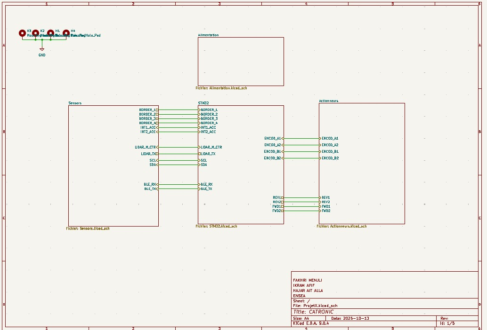
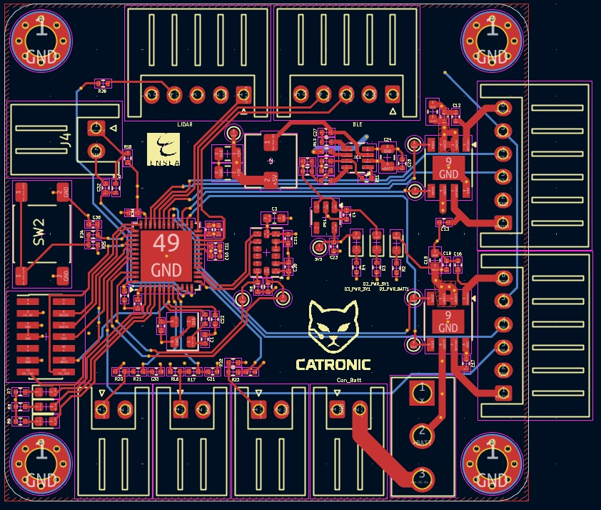
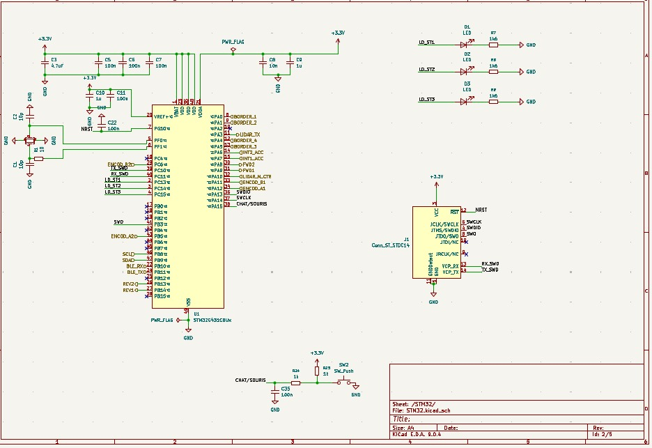
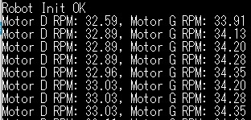
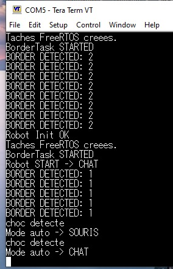
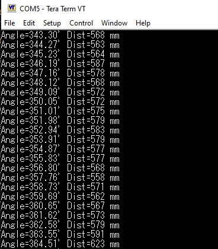
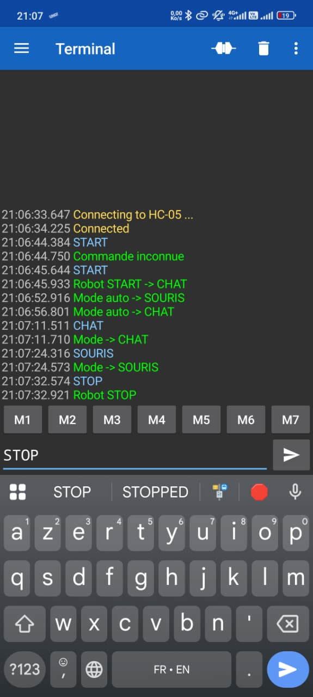

# 🤖 Projet CATRONIC : Robot Autonome "Chat et Souris"

<p align="center">
  
</p>

> **Auteurs :** AFIF Ikram, AIT ALLA Hajar, MENJLI Fakhri  
> **Année académique :** 2025/2026

Le robot **CATRONIC** est un système embarqué autonome conçu pour simuler un jeu de chat et de souris entre plusieurs robots identiques. Les robots évoluent sur une table sans bordures et sont capables de détecter les bords pour éviter toute chute.

---

##  Table des matières
- [Stratégie de fonctionnement](#stratégie-de-fonctionnement)
- [Architecture du système](#architecture-du-système-global)
  - [Schémas généraux](#schémas-généraux)
  - [Sous-systèmes](#sous-systèmes)
- [Nomenclature (Bill of Materials)](#nomenclature-bill-of-materials)
- [Structure logicielle et FreeRTOS](#structure-logicielle-et-freertos)
- [Tests et validation](#tests-et-validation)
- [Test final](#test-final)
- [Conclusion](#conclusion)

---

##  Stratégie de fonctionnement

La logique du robot est orchestrée par un noyau temps réel (**FreeRTOS**), permettant de gérer plusieurs tâches simultanément pour une réactivité maximale.

### Détection de l'environnement

- **Détection des bords :** Le robot utilise des **capteurs mécaniques Würth WS-MITV** positionnés à l’avant, à l’arrière, à gauche et à droite. Lorsqu’un capteur détecte le vide, il déclenche une interruption qui ordonne un changement immédiat de direction pour éviter la chute.  
- **Détection des adversaires :** Le **LIDAR YDLIDAR X2** scanne l’environnement à 360° et transmet en temps réel la position et la distance des autres robots.  
- **Détection des collisions :** L’**accéléromètre ADXL343** détecte les chocs par variation brutale d’accélération. Il est également utilisé comme arrêt d’urgence manuel.

### Modes de jeu

- **Mode Souris 🐭 :** Le robot cherche à maximiser la distance avec le “chat” tout en évitant les bords de la table.  
- **Mode Chat 🐱 :** Le robot identifie la “souris” la plus proche via le LIDAR et cherche à la percuter.

---

##  Architecture du système global

L’architecture est organisée autour de cinq sous-ensembles principaux : **alimentation**, **commande**, **acquisition**, **déplacement** et **interface utilisateur**.

### Schémas généraux

Vues d’ensemble de l’architecture matérielle :

**Figure 1 – Diagramme d’architecture fonctionnelle du robot:**


**Figure 2 – Schéma global du système:**



**Figure 3 – Routage du PCB principal:**



**Figure 4 – Vue 3D du PCB sous KiCad:**


### Sous-systèmes

####  Alimentation
Le robot est alimenté par une batterie **NiMH 7.2V**, régulée en **5V** pour le LIDAR et en **3.3V** pour le reste des composants.


*Figure 5 – Schéma d’alimentation du robot.*

####  Commande
Le cœur du système repose sur un **STM32G431CBU6** (ARM Cortex-M4) exécutant **FreeRTOS** pour coordonner les différentes tâches.



*Figure 6 – Schéma de la carte de commande STM32.*

#### Acquisition
Ce sous-système regroupe les capteurs assurant la perception de l’environnement.


*Figure 7 – Sous-système de détection (LIDAR, accéléromètre, capteurs WS-MITV).* 

####  Déplacement
Deux moteurs DC, commandés par des **drivers ZXBM5210-SP-13**, permettent un contrôle précis de la vitesse et de la direction via des signaux PWM.


*Figure 8 – Schéma des moteurs et drivers.*

####  Interface utilisateur
Interrupteur, bouton de démarrage, LED de statut et connecteur SWD pour le débogage.

---

##  Nomenclature (Bill of Materials)

| Composant | Référence | Datasheet |
|:---|:---|:---|
| Microcontrôleur | STM32G431CBU6 | [Datasheet](https://www.st.com/resource/en/datasheet/stm32g431c6.pdf) |
| Driver moteur | ZXBM5210-SP-13 | [Datasheet](https://www.mouser.fr/datasheet/3/175/1/ZXBM5210.pdf) |
| Accéléromètre | ADXL343BCCZ-RL | [Datasheet](https://www.analog.com/media/en/technical-documentation/data-sheets/adxl343.pdf) |
| LIDAR | YDLIDAR X2 | [Datasheet](https://cdn.robotshop.com/media/y/ydl/rb-ydl-04/pdf/ydlidar-x2-360-laser-scanner-datasheet2.pdf) |
| Régulateur 5V | MP1475DJ-LF-P | [Datasheet](https://www.farnell.com/datasheets/2915024.pdf) |
| Régulateur 3.3V | BU33SD5WG-TR | [Datasheet](https://fscdn.rohm.com/en/products/databook/datasheet/ic/power/linear_regulator/buxxsd5wg-e.pdf) |
| Batterie | NiMH 7.2V 1.3Ah | [Datasheet](https://fr.rs-online.com/web/p/blocs-batteries-rechargeables/7770377) |
| Capteur bordure | WS-MITV THT | [Datasheet](https://www.we-online.com/en/components/products/MITV_12_8X5_8_THT__LEVER_LEFT_55GF) |
| Bluetooth | HC-05 | [Datasheet](https://components101.com/sites/default/files/component_datasheet/HC-05%20Datasheet.pdf) |
| Boutons poussoirs | Wurth 430182070816 | [Datasheet](https://www.we-online.com/components/products/datasheet/430182070816.pdf) |
| Interrupteur ON/OFF | Wurth 472121020311 | [Datasheet](https://www.we-online.com/components/products/datasheet/472121020311.pdf) |

---
## Fichiers sources principaux

-   **`main.c`** : Point d'entrée du programme. Ce fichier initialise le microcontrôleur, tous les périphériques (GPIO, I2C, UART, Timers), les pilotes (moteurs, LIDAR), et crée les quatre tâches FreeRTOS qui orchestrent le comportement du robot.
-   **`robot_logic.c`** : Cœur de l'intelligence du robot. Il contient l'implémentation des tâches FreeRTOS qui gèrent la logique de jeu, la détection des collisions et des bordures, ainsi que la communication.
-   **`MoteurPWM.c`** : Pilote pour le contrôle des moteurs DC. Il fournit des fonctions pour initialiser les moteurs, et contrôler leur vitesse via des signaux PWM.
-   **`ADXL343_driver.c`** : Pilote pour l'accéléromètre ADXL343. Il gère l'initialisation du capteur et la détection de chocs.
-   **`driver_LIDAR.c`** : Pilote pour le capteur LIDAR YDLIDAR X2. Il traite les données brutes reçues via UART DMA pour en extraire la distance et l'angle des obstacles.
-   **`border_sensors.c`** : Gère la logique des capteurs de bordure.
-   **`drv_bt.c`** : Assure la gestion de la communication Bluetooth (HC-05), notamment la réception de commandes.

##  Structure logicielle et FreeRTOS

Le comportement du robot est géré par **quatre tâches FreeRTOS** principales :

1.  **`BorderTask`**
    -   **Rôle :** Surveille en permanence les capteurs de bordure.
    -   **Fonctionnement :** À intervalle régulier (100 ms), la tâche lit l'état des capteurs. Si un bord est détecté, elle met à jour une variable globale (`border_active`) protégée par un mutex pour signaler l'état et la direction du bord détecté à la tâche principale `RobotModeTask`.

2.  **`ShockTask`**
    -   **Rôle :** Détecte les collisions et inverse les rôles "Chat" et "Souris".
    -   **Fonctionnement :** La tâche initialise l'accéléromètre pour la détection de chocs. Elle vérifie en continu si un choc a eu lieu. Si c'est le cas, elle change l'état du robot (`robot_mode`) de `CHAT` à `SOURIS` ou inversement.

3.  **`BluetoothTask`**
    -   **Rôle :** Traite les commandes reçues via Bluetooth.
    -   **Fonctionnement :** La tâche attend de recevoir des commandes utilisateur. Elle peut ainsi forcer le robot à s'arrêter (`STOP`), à démarrer (`START`), ou à passer en mode `CHAT` ou `SOURIS`, offrant un contrôle manuel sur le comportement du robot.

4.  **`RobotModeTask`**
    -   **Rôle :** Tâche principale qui exécute la logique de déplacement et de jeu.
    -   **Fonctionnement :** C'est la tâche la plus complexe. À chaque cycle :
        -   Elle vérifie l'état de la variable `border_active`. Si un bord est détecté, elle exécute une manœuvre d'évitement prioritaire (reculer puis tourner) pour empêcher le robot de tomber.
        -   Si aucun bord n'est détecté, elle exécute la logique de jeu en fonction de la variable `robot_mode` :
            -   **Mode `ROBOT_STOP` :** Les moteurs sont à l'arrêt.
            -   **Mode `ROBOT_MODE_CHAT` (Poursuite) :** La tâche analyse les données du LIDAR pour trouver l'obstacle le plus proche. Si l'obstacle est en face, elle commande au robot d'avancer. Sinon, elle le fait tourner pour se diriger vers la cible.
            -   **Mode `ROBOT_MODE_SOURIS` (Fuite) :** Si un obstacle (le "chat") est détecté à moins de 30 cm, le robot recule pour s'en éloigner. Sinon, il continue d'avancer pour explorer la zone de jeu.
        -   Si aucun obstacle n'est détecté par le LIDAR, le robot s'arrête.

---

##  Tests et validation

Pour garantir la fiabilité du système, plusieurs séries de tests ont été menées.

### Test de déplacement et moteurs

Ce test valide le contrôle PWM et met en évidence les écarts de vitesse entre les moteurs. 
Un ajustement asymétrique des vitesses a permis d’améliorer la précision du déplacement du robot.



### Test de détection de bordures/détection de collision

Ce test est crucial pour la sécurité du robot. Il valide la robustesse des capteurs mécaniques, et la détection des chocs via l'accéléromètre qui déclenche le changement de rôle du robot
- **Approche frontale :** Le robot est dirigé droit vers le bord de la table. On vérifie qu'il s'arrête et recule à chaque fois, sans chute.
- **Approche en diagonale :** Le test est répété avec différents angles d'approche pour s'assurer que le levier du capteur est bien actionné même lorsque le robot n'est pas perpendiculaire au bord.
- **Fiabilité :** Répétition du test des dizaines de fois pour garantir la reproductibilité et la fiabilité du mécanisme.
- **Changement de mode après impact :** Après une collision détectée par l'accéléromètre, on vérifie que les rôles "Chat" et "Souris" sont bien inversés.



*Figure 9 – Détection de bordures/chocs et changement de direction.*


### Test du LIDAR et logique de jeu

Ce test valide la perception de l'environnement et la stratégie comportementale.
- **Fiabilité de la détection d'adversaire :** Vérification que le LIDAR détecte de manière fiable la position de l'autre robot.
- **Logique de poursuite/fuite :** Validation de la trajectoire du robot en fonction des données du LIDAR (le "Chat" se rapproche de la "Souris", et la "Souris" s'en éloigne).



*Figure 10 – Données LIDAR capturées via Tera Term (UART DMA).* 

### Test Bluetooth

Ce test vérifie la connectivité et la fiabilité de la communication sans fil via le module Bluetooth HC-05.

- **Connexion :** Vérification de l'établissement de la connexion Bluetooth avec un appareil externe.

- **Transmission de données :** Test de l'envoi et de la réception de données entre le robot et l'appareil connecté.

- **Changement de mode à distance :** Validation de la capacité à modifier le rôle du robot (Chat/Souris) via une commande Bluetooth.




*Figure 11 – Communication Bluetooth et affichage des données.*

---
## Structure du dépôt GitHub

```
├── Firmware/           → Code STM32CubeIDE 
├── Hardware/           → Schémas, PCB et vues 3D KiCad
├── Media/              → Illustrations et résultats de tests
└── README.md           → Présentation du projet
```

---
##  Test final


Lors du test final, le robot a validé plusieurs fonctionnalités clés. Les capteurs de bordure fonctionnent correctement, permettant au robot de détecter les limites de la surface et d’éviter toute chute. La commande via Bluetooth est également opérationnelle : il est possible de sélectionner le mode de fonctionnement du robot ainsi que d’envoyer des commandes Start et Stop pour lancer ou arrêter le système. Les données du LiDAR ont pu être lues avec succès, cependant toutes les mesures n’étaient pas fiables et l’intégration complète du capteur dans le système embarqué n’a pas pu être finalisée. En conséquence, le robot n’est pas capable de détecter les autres robots à ce stade. Enfin, l’accéléromètre permet de détecter les chocs lors d’une collision, déclenchant automatiquement un changement de mode de fonctionnement du robot.


---
## Conclusion

Ce projet a permis de concevoir et de mettre en œuvre un robot mobile intégrant plusieurs capteurs et modes de fonctionnement. Les tests finaux ont validé avec succès la détection des bordures, la commande via Bluetooth avec sélection des modes ainsi que la gestion des collisions à l’aide de l’accéléromètre. Ces fonctionnalités assurent un fonctionnement sûr et contrôlable du robot.

Cependant, certains défis techniques ont été rencontrés, notamment lors de l’exploitation et de l’intégration du LiDAR. Bien que les données aient pu être lues, leur fiabilité et leur intégration complète dans l’architecture embarquée n’ont pas pu être finalisées, empêchant la détection des autres robots. Ces limitations sont principalement liées aux contraintes de temps et à la complexité du traitement des données capteur.

Ce travail a néanmoins permis d’acquérir une expérience pratique solide en systèmes embarqués, en communication sans fil et en intégration capteurs. Des perspectives d’amélioration incluent l’optimisation du traitement des données LiDAR, l’amélioration de la fusion capteurs et l’extension des capacités de détection du robot.

---

<p align="center">
  2026 — Projet académique ENSEA
  <br>Développement d’un robot autonome Chat–Souris 
</p>

