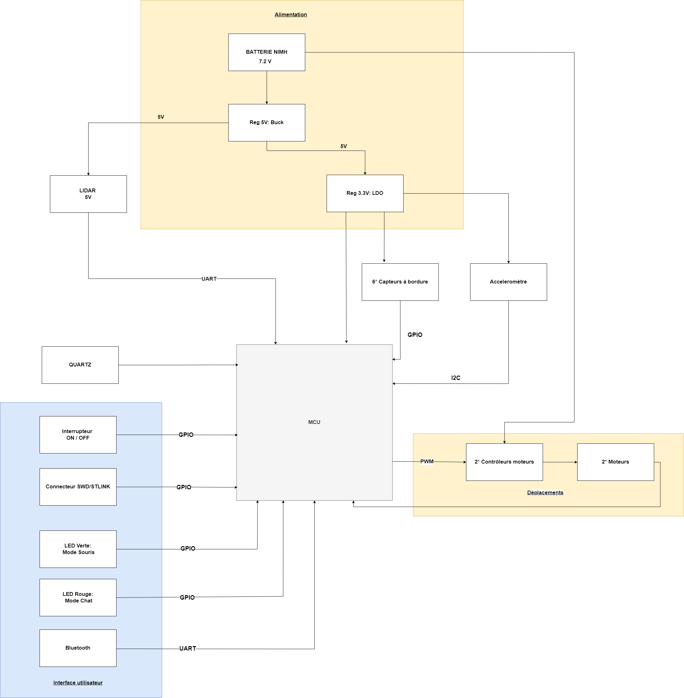
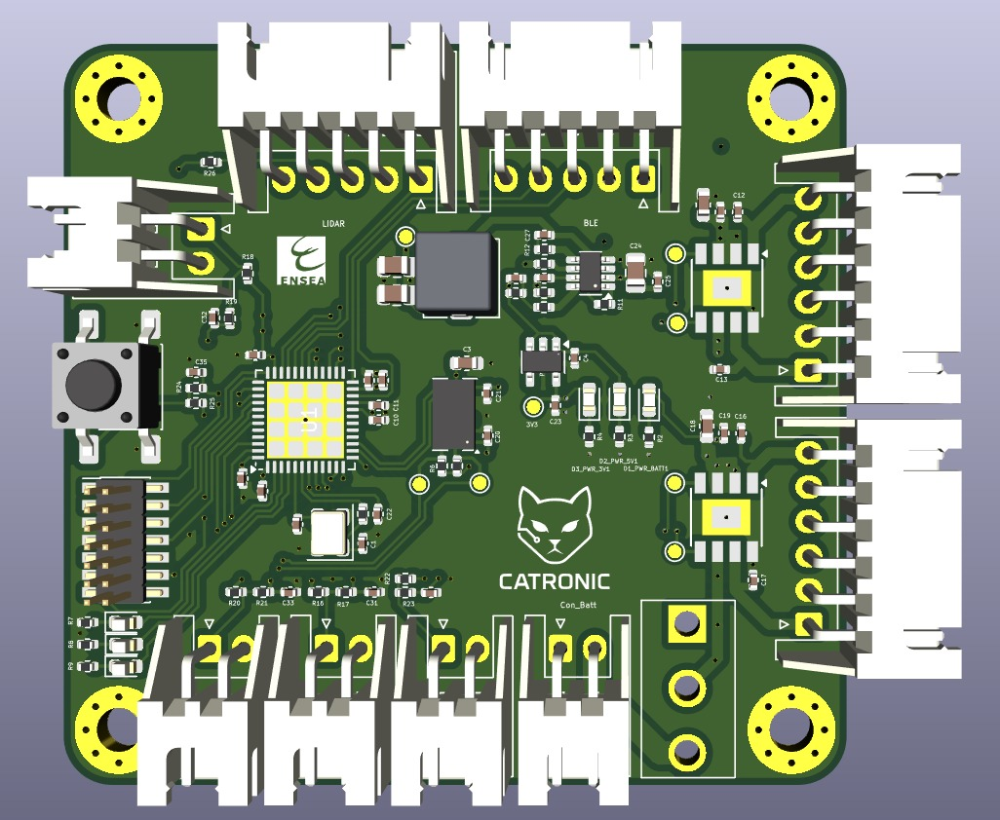
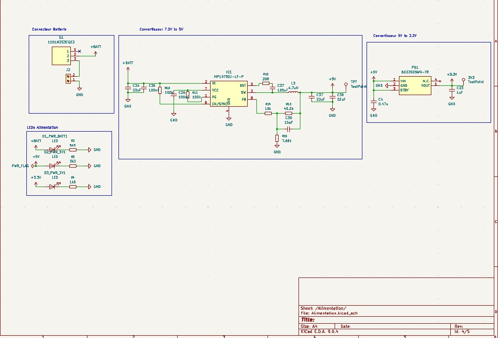
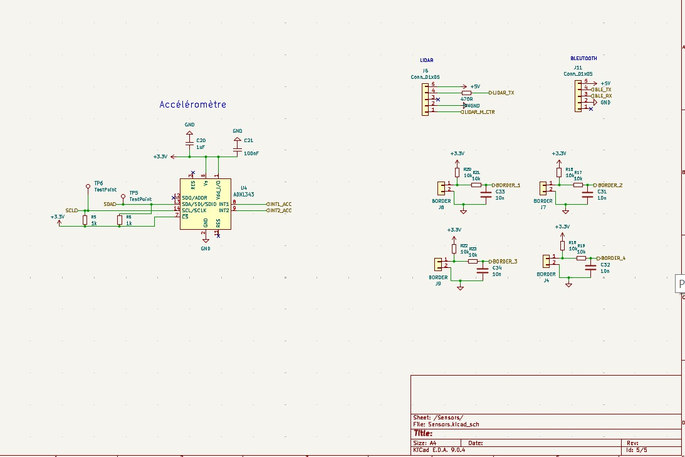
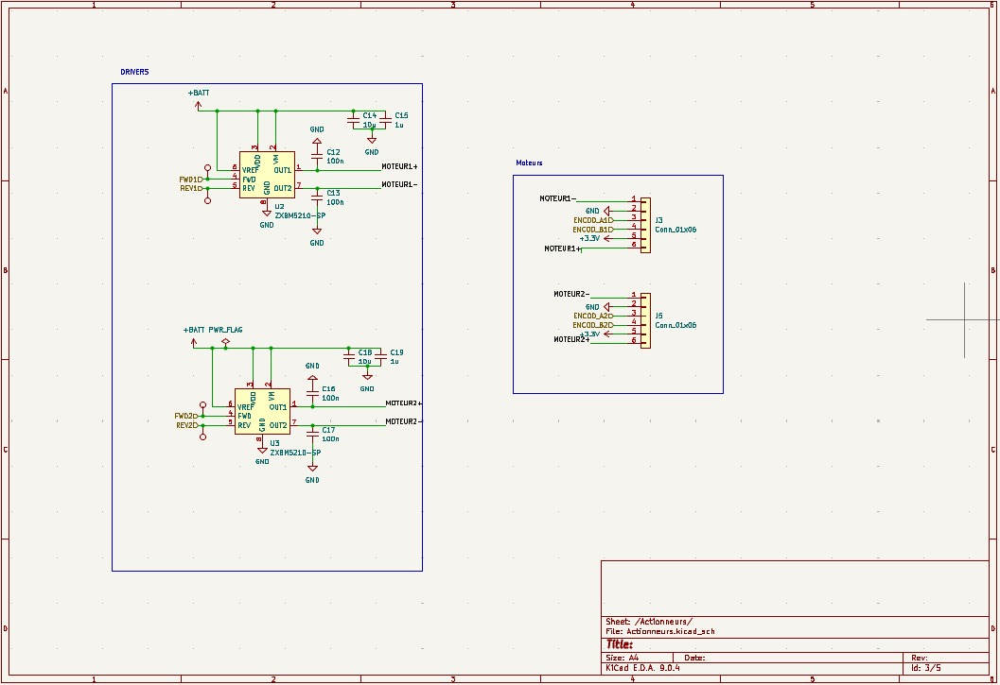

# Projet CATRONIC : Robot Autonome "Chat et Souris"

> **Auteurs :** AFIF Ikram, AIT ALLA Hajar, MENJLI Fakhri

Le robot **CATRONIC** est un système embarqué autonome conçu pour simuler un jeu de chat et de souris entre plusieurs robots identiques. Les robots évoluent sur une table sans bordures et sont capables de détecter les bords pour éviter toute chute.

## Table des matières
- [Stratégie de fonctionnement](#stratégie-de-fonctionnement)
- [Architecture du système](#architecture-du-système-global)
  - [Schémas généraux](#schémas-généraux)
  - [Sous-systèmes](#sous-systèmes)
- [Nomenclature (Bill of Materials)](#nomenclature-bill-of-materials)
- [Structure du projet](#structure-du-projet)
- [Installation et compilation](#installation-et-compilation)
- [Tests et Validation](#tests-et-validation)
- [Conclusion](#conclusion)

---

## Stratégie de fonctionnement

La logique du robot est orchestrée par un noyau temps réel (FreeRTOS), permettant de gérer plusieurs tâches simultanément pour une réactivité maximale.

#### Détection de l'environnement
- **Détection des bords :** La stratégie de déplacement repose sur la détection des bords de la table grâce à des **capteurs mécaniques Würth MITV** positionnés à l’avant. Au contact du vide, le levier du capteur enclenche un signal qui déclenche une interruption, forçant le robot à changer de direction immédiatement pour ne pas tomber. Cette solution est robuste et fiable.
- **Détection des adversaires :** La position des autres robots est détectée par le **LIDAR YDLIDAR X2**, qui scanne l'environnement à 360°. Les données sont traitées en temps réel pour déterminer la position et la distance de l'adversaire.
- **Détection des collisions :** L'**accéléromètre ADXL343** est utilisé pour détecter les impacts. Une forte accélération soudaine est interprétée comme une collision avec un autre robot. Il peut également servir d'arrêt d'urgence manuel.

#### Modes de jeu
-   **Mode Souris :** Le robot analyse en permanence les données du LIDAR pour localiser le "chat". Sa stratégie est de maximiser la distance avec ce dernier, en ajustant sa trajectoire pour fuir tout en continuant d'éviter les bords de la table.
-   **Mode Chat :** Le robot utilise les données du LIDAR pour identifier la "souris" la plus proche. Il calcule en continu la trajectoire la plus courte pour l'intercepter et la percuter.

---

## Architecture du système global

L’architecture est organisée autour de cinq sous-ensembles principaux : l’alimentation, la commande, l’acquisition, le déplacement, et l’interface utilisateur.

### Schémas généraux

Vues d'ensemble de l'architecture matérielle du robot :

### Sous-systèmes

#### Alimentation
Le robot est alimenté par une batterie NiMH (7.2V), avec deux régulateurs pour fournir les tensions nécessaires aux composants électroniques (5V pour le LIDAR, 3.3V pour le reste).

#### Commande
Le cerveau est un **STM32G431CBU6** (ARM Cortex-M4) qui exécute le code applicatif basé sur FreeRTOS, assurant la gestion multitâche des différentes fonctionnalités.

#### Acquisition
Ce sous-système regroupe tous les capteurs qui permettent au robot de percevoir son environnement.

*Aperçu des capteurs de détection.*

#### Déplacement
Deux moteurs DC avec drivers **ZXBM5210-SP-13** permettent un contrôle fin de la vitesse et de la direction (contrôle différentiel) via des signaux PWM.

*Schéma des actionneurs (moteurs et drivers).*

#### Interface Utilisateur
Elle se compose d'un interrupteur, d'un bouton de démarrage, d'une LED de statut et d'un connecteur de débogage SWD.

---

## Nomenclature (Bill of Materials)

| Composant | Référence | Datasheet |
| :--- | :--- | :--- |
| Microcontrôleur | STM32G431CBU6 | [Datasheet](https://www.st.com/resource/en/datasheet/stm32g431c6.pdf) |
| Quartz 16 MHz | 2853935 | [Datasheet](https://www.farnell.com/datasheets/3820205.pdf) |
| Connecteur SWD/STLink | 3226055 | [Datasheet](https://fr.farnell.com/search?st=3226055) |
| Drivers moteurs | ZXBM5210-SP-13 | [Datasheet](https://www.mouser.fr/datasheet/3/175/1/ZXBM5210.pdf) |
| Moteur | DfRobot FIT0521 | [Datasheet](https://www.farnell.com/datasheets/4020622.pdf) |
| Accéléromètre | ADXL343BCCZ-RL | [Datasheet](https://www.analog.com/media/en/technical-documentation/data-sheets/adxl343.pdf) |
| Régulateur 5V | MP1475DJ-LF-P | [Datasheet](https://www.farnell.com/datasheets/2915024.pdf) |
| Régulateur 3.3V | BU33SD5WG-TR | [Datasheet](https://fscdn.rohm.com/en/products/databook/datasheet/ic/power/linear_regulator/buxxsd5wg-e.pdf) |
| Capteur bordure | WS-MITV THT | [Datasheet](https://www.we-online.com/en/components/products/MITV_12_8X5_8_THT__LEVER_LEFT_55GF?srsltid=AfmBOop_09ZKBulDEUMT56na_Lw8uq-FOG4b0nJ1FolflhKEqqaWS8rj) |
| Lidar | YDLIDAR X2 ou X4 | [Datasheet](https://cdn.robotshop.com/media/y/ydl/rb-ydl-04/pdf/ydlidar-x2-360-laser-scanner-datasheet2.pdf) |
| Connecteurs | JST 2.54mm | [Datasheet](https://www.farnell.com/datasheets/5448.pdf) |
| LED | | |
| Batterie | NIMH 7.2V 1.3Ah | [Datasheet](https://fr.rs-online.com/web/p/blocs-batteries-rechargeables/7770377?searchId=f22a0a7e-fb35-451d-89e3-ca820f2491d6&gb=s) |
| Boutons poussoirs | Wurth 430182070816 | [Datasheet](https://www.we-online.com/components/products/datasheet/430182070816.pdf) |
| Interrupteur ON/OFF | Wurth 472121020311 | [Datasheet](https://www.we-online.com/components/products/datasheet/472121020311.pdf) |
| Bluetooth | HC05 | [Datasheet](https://components101.com/sites/default/files/component_datasheet/HC-05%20Datasheet.pdf) |

---

## Tests et Validation

Pour garantir la fiabilité et la performance du robot CATRONIC, une série de tests unitaires et d'intégration a été menée sur chaque sous-système. Cette section documente les procédures de test et les résultats obtenus.

### Test de déplacement et des moteurs
L'objectif est de valider le contrôle des moteurs et la précision des déplacements.
- **Test de trajectoire rectiligne :** Vérification que le robot avance droit sur une distance donnée. Les écarts ont été mesurés et corrigés via l'asservissement des encodeurs.
- **Test de rotation :** Mesure de la précision des rotations (ex: 90°, 180°).
- **Réponse du PWM :** Analyse de l'efficacité de la commande PWM pour l'accélération, la décélération et la correction de trajectoire.

### Test de la détection de bordures
Ce test est crucial pour la sécurité du robot. Il valide la robustesse des capteurs mécaniques.
- **Approche frontale :** Le robot est dirigé droit vers le bord de la table. On vérifie qu'il s'arrête et recule à chaque fois, sans chute.
- **Approche en diagonale :** Le test est répété avec différents angles d'approche pour s'assurer que le levier du capteur est bien actionné même lorsque le robot n'est pas perpendiculaire au bord.
- **Fiabilité :** Répétition du test des dizaines de fois pour garantir la reproductibilité et la fiabilité du mécanisme.

*Visualisation du comportement du robot lors de la détection de bordures et de la commutation des modes "Chat"/"Souris".*

### Test de détection de collision et changement de mode
Ce test valide que la détection d'un choc via l'accéléromètre déclenche le changement de rôle du robot, comme illustré par l'image `test1.jpg`.
- **Changement de mode après impact :** Après une collision détectée par l'accéléromètre, on vérifie que les rôles "Chat" et "Souris" sont bien inversés.

### Test du LIDAR et de la logique de jeu
Ce test valide la perception de l'environnement et la stratégie comportementale.
- **Fiabilité de la détection d'adversaire :** Vérification que le LIDAR détecte de manière fiable la position de l'autre robot.
- **Logique de poursuite/fuite :** Validation de la trajectoire du robot en fonction des données du LIDAR (le "Chat" se rapproche de la "Souris", et la "Souris" s'en éloigne).

*Capture d'écran de Tera Term montrant les données du LIDAR pour la détection d'obstacles.*

### Test de communication (Bluetooth)

Ce test vérifie la connectivité et la fiabilité de la communication sans fil via le module Bluetooth.

- **Connexion :** Vérification de l'établissement de la connexion Bluetooth avec un appareil externe.

- **Transmission de données :** Test de l'envoi et de la réception de données entre le robot et l'appareil connecté.

- **Changement de mode à distance :** Validation de la capacité à modifier le rôle du robot (Chat/Souris) via une commande Bluetooth.

*Visualisation des données échangées via Bluetooth ou du statut de connexion.*

---

## Conclusion

Le projet CATRONIC a permis de mettre en œuvre un cycle complet de développement de système embarqué, de la conception matérielle à la programmation d'une intelligence artificielle comportementale.

### Apprentissages
Ce projet a été une excellente opportunité d'appliquer des compétences en conception de PCB (KiCad), en programmation de microcontrôleurs (STM32), en systèmes temps réel (FreeRTOS) et en robotique mobile (stratégie de déplacement, perception).
